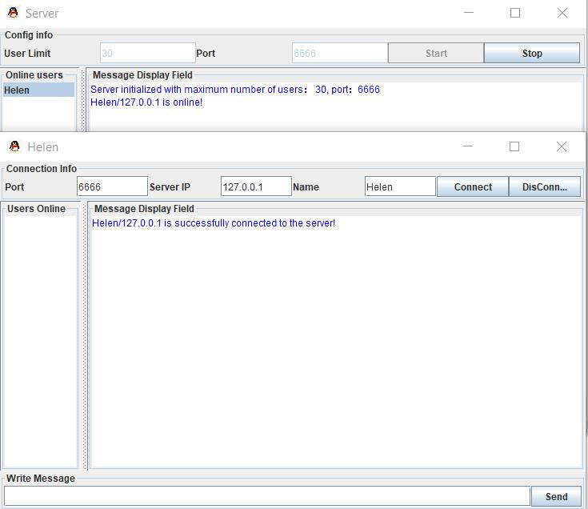

# Chat-Room
A simple group chat room program based on Java Socket and Swing.
This program builds up connection via socket. When server is initialized, server thread keeps waiting for Client's request for connection. When a connection is successful, Server send onLineUsers list to client through I/O stream. Client Thread keeps receiving messages from Server side.

